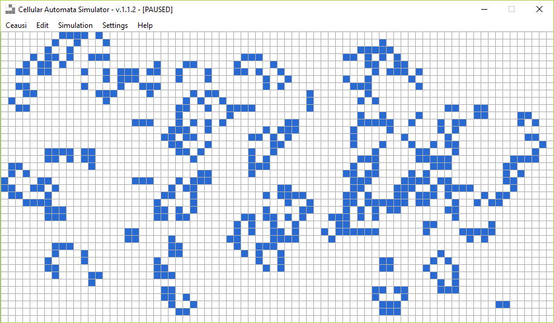
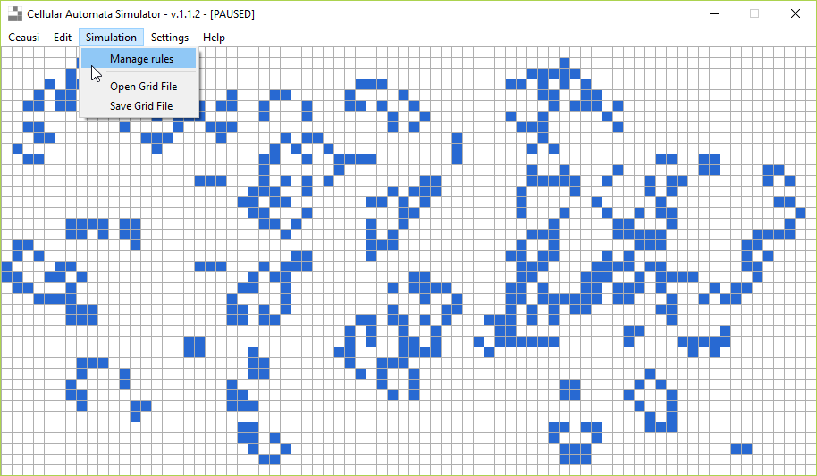
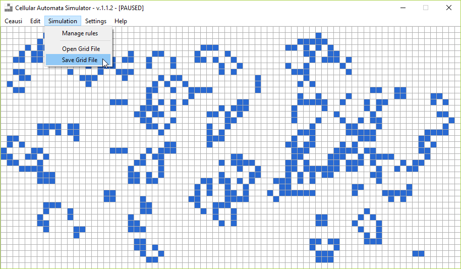

# Cellular Automata Simulator

Simulator of 2Dimensions cellular automatas with various user-definded rules.

## Overview

## Controls

Press key '**C**' to clear grid

Press key '**Space**' to toggle running

Press key '**R**' to regen grid

Press key '**N**' to generate only next step (works only if the simulation is paused.)

## Rules

You can manage your rules using top menu :'Simulation -> Manage rules'

### Add rule

### Export rules

## Grids

You can save and load your grids using top menu :'Simulation -> Open Grid File'

